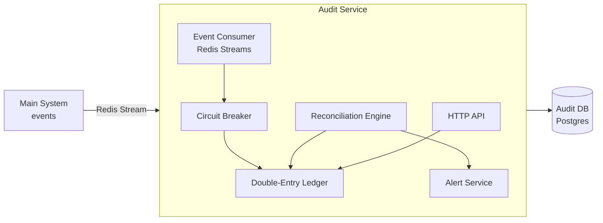

# audit-service-pattern

An independent audit service implementing double-entry ledger, automated reconciliation, circuit breaker and alert system. Subscribes to system events via Redis Streams without ever writing to the main system.

---

## Architecture



---

## Components

| Component | File | Description |
|-----------|------|-------------|
| Double-Entry Ledger | `src/ledger/doubleEntry.ts` | Records debits/credits; enforces invariant |
| Schema | `src/ledger/schema.ts` | Accounts, ledger_entries, audit_events tables |
| Event Consumer | `src/consumer/eventConsumer.ts` | Redis Streams reader with consumer group |
| Circuit Breaker | `src/circuit-breaker/circuitBreaker.ts` | CLOSED/OPEN/HALF_OPEN state machine |
| Reconciler | `src/reconciliation/reconciler.ts` | Periodic invariant + balance verification |
| Alert Service | `src/alerts/alertService.ts` | Webhook-based alerts for critical issues |
| HTTP API | `src/api/routes/ledger.ts` | Query API for investigation |

---

## Invariant

The fundamental rule of double-entry accounting:

```
SUM(all debit entries) == SUM(all credit entries)
```

Verified via `GET /audit/invariant`. If broken, a critical alert is raised.

---

## Quick Start

```bash
make install
cp .env.example .env
make up
make logs
```

---

## API

| Method | Endpoint | Description |
|--------|----------|-------------|
| GET | `/audit/health` | Health check |
| GET | `/audit/accounts` | Account balances |
| GET | `/audit/ledger` | Ledger entries |
| GET | `/audit/invariant` | Verify double-entry invariant |
| POST | `/audit/reconcile` | Run reconciliation |
| GET | `/audit/events` | Audit event log |

---

## Integration

Point `REDIS_STREAM` to the same stream used by your main system to start receiving and auditing its events automatically.

---

## Tutorial

See [docs/tutorial.md](docs/tutorial.md) for complete walkthrough: double-entry accounting, circuit breaker pattern, reconciliation engine, and architecture diagrams.
