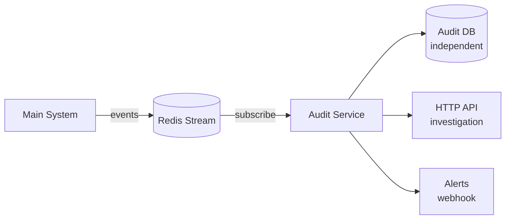
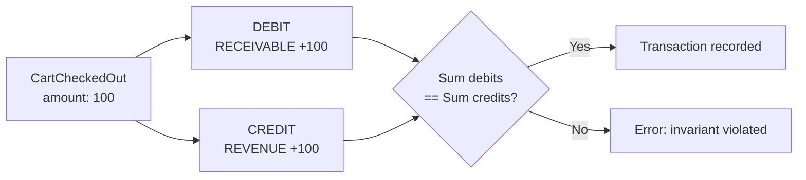
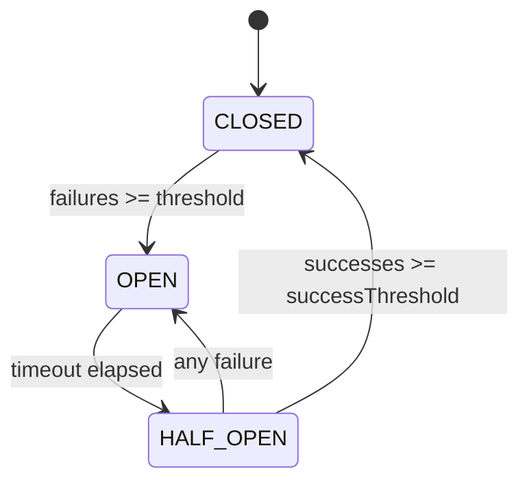
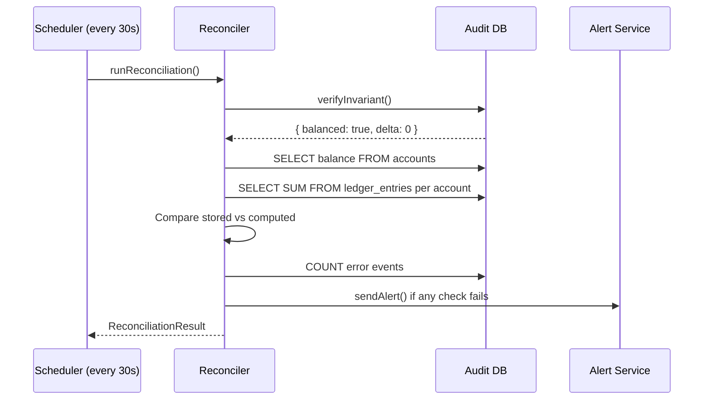
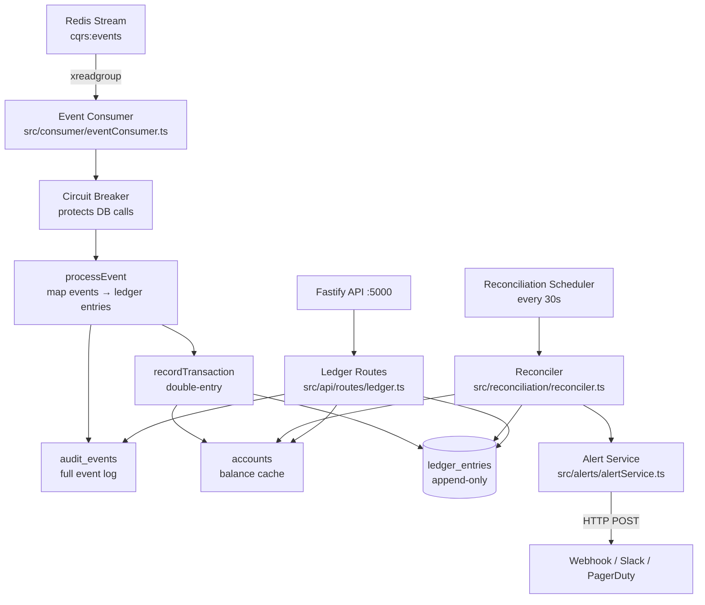

# Audit Service Pattern — Tutorial

## Objective

Build a fully independent audit service that: subscribes to system events without ever writing to the main system, records financial movements using a double-entry ledger, runs automated reconciliation, and protects itself from database failures using a circuit breaker.

---

## 1. The Independent Audit Principle

The audit service is a **passive observer**. It:
- Reads events from a shared stream (Redis)
- Maintains its OWN database (never touches the main system DB)
- Exposes a query API for investigation
- Raises alerts when inconsistencies are detected



**Critical rule**: The audit service NEVER writes to the main system. It only reads events and maintains its own ledger.

---

## 2. Double-Entry Ledger

Every financial movement is recorded as two entries that balance each other.



### The invariant

```
SUM(all debits) == SUM(all credits)
```

This must ALWAYS be true. If it is not, money was either created or destroyed — a critical bug.

### Account types

| Account | Type | Description |
|---------|------|-------------|
| RECEIVABLE | Asset | Money owed by users |
| ESCROW | Liability | Funds held pending |
| REVENUE | Revenue | Income recognized |
| PAYOUT | Expense | Funds disbursed |

### Example journal entry

When a cart is checked out for $100:
```
DEBIT  RECEIVABLE  $100   # user owes $100
CREDIT REVENUE     $100   # we recognized $100 income
```

---

## 3. Circuit Breaker

Protects the audit service from cascading failures when the database is slow or unavailable.



| State | Behavior |
|-------|----------|
| CLOSED | Operating normally; each failure increments counter |
| OPEN | Fail-fast; all calls rejected immediately |
| HALF_OPEN | Testing recovery; limited calls allowed |

```typescript
const cb = new CircuitBreaker('audit-db', {
  failureThreshold: 5,   // open after 5 consecutive failures
  successThreshold: 3,   // close after 3 consecutive successes
  timeoutMs: 60000,      // try HALF_OPEN after 60s
});

await cb.execute(() => processEvent(pool, event));
// → throws if OPEN (fail-fast)
// → calls processEvent if CLOSED or HALF_OPEN
// → updates state based on outcome
```

---

## 4. Reconciliation Engine

Runs on a schedule and verifies:
1. Double-entry invariant (debits == credits globally)
2. Account balance consistency (stored balance == computed from entries)
3. Event processing errors



---

## 5. Architecture Overview



---

## 6. Setup

```bash
make install
cp .env.example .env
make up
make logs
```

---

## 7. HTTP API Reference

| Method | Path | Description |
|--------|------|-------------|
| GET | `/audit/health` | Service health check |
| GET | `/audit/accounts` | All accounts with balances |
| GET | `/audit/accounts/:name/balance` | Single account balance |
| GET | `/audit/ledger` | Ledger entries (paginated, filterable) |
| GET | `/audit/invariant` | Verify double-entry invariant |
| POST | `/audit/reconcile` | Trigger manual reconciliation |
| GET | `/audit/events` | Audit event log |

### Example usage

```bash
# Check invariant
curl http://localhost:5000/audit/invariant
# → { "balanced": true, "delta": 0 }

# Trigger reconciliation
curl -X POST http://localhost:5000/audit/reconcile
# → { "passed": true, "timestamp": "...", ... }

# Check ledger for a specific account
curl "http://localhost:5000/audit/ledger?account=REVENUE"
```

---

## 8. Integration with cqrs-event-sourcing-lab

The audit service subscribes to the same Redis stream as `cqrs-event-sourcing-lab`. To run them together:

1. Start `cqrs-event-sourcing-lab` infrastructure (Redis on port 6379)
2. In `audit-service-pattern/.env`, point Redis to the same host/port and stream key
3. Start the audit service: `make up`
4. Every event from the CQRS lab will automatically be audited

---

## 9. Key Takeaways

| Concept | What to remember |
|---------|-----------------|
| Independent audit | Never write to main system; own DB, own stream consumer |
| Double-entry | Every transaction: debit one account, credit another; they must balance |
| Invariant | SUM(debits) == SUM(credits) at all times |
| Circuit breaker | Fail-fast when dependencies are down; prevents resource exhaustion |
| Reconciliation | Periodic automated verification; catch drift early |
| Consumer group | Multiple audit instances can share load via Redis consumer groups |
| XACK | ACK only after successful processing; failures are re-delivered |
